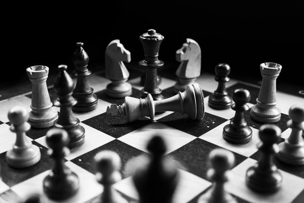

# Checkers 1.0

The current state of the game offers a Checkers format.
Future updates will include a Chess format.

## Table of Contents

-   [Installation](#installation)
-   [Usage](#usage)
-   [Features](#features)
-   [Contributing](#contributing)
-   [License](#license)

# Initialization

### The board comes with two different colors of checkers — Black and White.

### Each player has three rows of four checkers each. 12 total

### White pieces go first

### The board is made of alternating light and dark squares.

# Rules

## How to Move

### Checkers can only move diagonally on dark squares.

### At the start of the game, checkers can only move forward, meaning toward the opposite player’s side.

### Checkers may move forward and backward only after they become “kings”. Pieces become "kings" after having reached the last row on the opposite side of the board.

## Turns

### Players are only allowed to move one checker per turn, moving one space at a time unless double-jumping.

### After the first player takes their turn the next player goes, also moving their checker forward diagonally.

## Win Conditions

### Remove the opponent’s checkers from the board by jumping them. Jumping is when a Players checker is diagonal to the opponent’s and there is an empty dark space on the other side. Jump the opponents checker and land on the empty dark space, then remove that opponents checker which was jumped.

### Whichever Player captures all their opponents’ checkers wins.

### Players continue taking turns either advancing pieces or jumping to capture checkers until one color remains on the board.

### A Player may also win if all valid moves are blocked and that Player has the most pieces.

## Double Jumping

### If the space a Player lands on after jumping the opponent’s checker puts that Player in a position to jump another of their opponents' checkers,then a “double jump” is allowed. A double jump is when two jumps are made consecutively within a single turn.

## Kinging

### Players must try to get to the end of their opponent’s side.

## Once a piece reaches the last row on their opponents' side, that piece becomes a king and can now move forward or backward diagonally.

# Strategies for checkers

## Guard your side: Try to keep your checkers in the last row as long as possible. This will prevent your opponent from turning their checkers into kings and having greater mobility around the board.

## Sacrifice a checker: As the saying goes, you can’t make an omelet without breaking a few eggs. Sometimes losing one checker may put you in the situation to capture one or more of your opponent’s. Keep in mind your long-term goal of winning instead of focusing only on defending.

## Control the center: While it’s a beginner’s instinct to move to the edge of the board to evade captivity, forming a pyramid with your checkers in the center will help keep your pieces together and prevent your opponent from reaching the end of your side.

## Keep your pieces together: There truly is strength in numbers. Moving your checkers in pairs is advisable because a solo checker can easily be jumped.

## Win by blocking: Getting all your opponent’s checkers is not the only way to win the game. You may be able to block your opponent’s non-king pieces from moving, especially in the corners.

# Technologies

## HTML

## CSS

## Javascript

# Post Updates:

### Competition against AI. As of now the game requires 2 Users on the same device to alternate turns

### High-Score/Win ratio tracker

### Future UI and QOL enhancements
